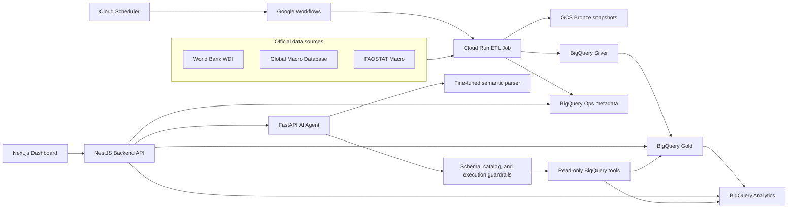

# Government AI Agent Platform

Nền tảng phân tích dữ liệu kinh tế cloud-native với giao diện truy vấn ngôn ngữ tự nhiên có kiểm soát.

[Demo trực tuyến](https://gov-ai-frontend-lnv3c6gztq-as.a.run.app) | [Repository](https://github.com/DataMeowTt/Government-Ai-Agent-Platform)

## Tổng quan

Government AI Agent Platform tích hợp dữ liệu kinh tế công khai, chuẩn hóa dữ liệu thành các lớp phân tích, rồi cung cấp cho người dùng thông qua dashboard và trợ lý AI. Hệ thống được thiết kế theo kiến trúc **BigQuery-direct**: BigQuery là nguồn dữ liệu phân tích chính cho Backend API và AI Agent, còn Google Cloud Storage lưu snapshot dữ liệu thô và bằng chứng vận hành.

Các nguồn dữ liệu hiện được tích hợp:

- World Bank World Development Indicators (WDI)
- Global Macro Database (GMD)
- FAOSTAT Macro

Bộ dữ liệu demo có hơn **1.16 triệu dòng dữ liệu thô** trước chuẩn hóa. Hệ thống hỗ trợ hồ sơ quốc gia, so sánh chỉ số, phân nhóm cấu trúc, phát hiện bất thường, theo dõi độ mới dữ liệu và hỏi đáp dữ liệu kinh tế bằng ngôn ngữ tự nhiên.

## Tính năng chính

- Thu thập dữ liệu nhiều nguồn với fingerprint, snapshot, manifest và lineage artifact.
- Thiết kế warehouse theo lớp: GCS Bronze và BigQuery Silver, Gold, Analytics, Ops.
- Quản lý indicator, table và data-quality rule bằng contract.
- Dashboard cho quốc gia, chỉ số, so sánh, cluster, anomaly và AI chat.
- Truy cập BigQuery có guardrail: whitelist bảng/cột, input tham số hóa, giới hạn kết quả và giới hạn chi phí truy vấn.
- Chuyển câu hỏi tự nhiên thành `ParsedQuery` JSON có kiểu rõ ràng thay vì sinh SQL tự do.
- Kiểm tra schema, catalog và điều kiện safe-to-execute trước khi AI truy vấn dữ liệu.
- Bộ công cụ BigQuery read-only cho lookup, compare, ranking, trend, anomaly và coverage.
- Tự động hóa ETL hằng tháng bằng Cloud Scheduler, Google Workflows và Cloud Run Job.
- Metadata freshness được ghi vào BigQuery Ops và hiển thị trên Frontend.

## Kiến trúc



### Luồng request chính

**Luồng dashboard**

```text
Người dùng -> Next.js Frontend -> NestJS endpoint -> truy vấn BigQuery có guardrail -> dữ liệu bảng/biểu đồ
```

**Luồng AI**

```text
Câu hỏi -> Backend proxy -> AI Agent -> ParsedQuery JSON
       -> schema/catalog/safety checks -> read-only BigQuery tool
       -> câu trả lời có căn cứ dữ liệu + bảng + cấu hình biểu đồ
```

AI Agent không có quyền ghi dữ liệu warehouse và không được kích hoạt pipeline ETL.

## Nền tảng dữ liệu

### Quy mô dữ liệu nguồn trong demo

| Nguồn | Số dòng | Số cột | Dạng dữ liệu nguồn |
| --- | ---: | ---: | --- |
| WDI | 403,256 | 70 | World Bank bulk CSV, wide theo năm |
| FAOSTAT Macro | 708,632 | 13 | Normalized CSV kèm codebook |
| GMD | 56,864 | 84 | Wide country-year CSV |
| **Tổng** | **1,168,752** | - | Dữ liệu thô trước chuẩn hóa |

### Các lớp lưu trữ

| Lớp | Lưu trữ | Mục đích |
| --- | --- | --- |
| Bronze | Google Cloud Storage | Snapshot dữ liệu thô, manifest, fingerprint, lineage và bằng chứng khôi phục |
| Silver | BigQuery `gov_ai_silver` | Dữ liệu long-format đã chuẩn hóa theo country, year, indicator và source |
| Gold | BigQuery `gov_ai_gold` | Bảng chủ đề đã curate cho growth, fiscal-monetary, crisis risk, social welfare và structural composition |
| Analytics | BigQuery `gov_ai_analytics` | Kết quả trend, anomaly, residual và clustering |
| Ops | BigQuery `gov_ai_ops` | Metadata lần chạy pipeline, trạng thái publish, trạng thái nguồn và freshness |

Các contract trong [`contracts/`](contracts/) mô tả indicator public, cấu trúc bảng, capability, đơn vị, mapping và rule kiểm tra chất lượng. Artifact sinh từ contract giúp Python pipeline, TypeScript backend và AI catalog dùng cùng một định nghĩa.

## AI Agent

Semantic parser chuyển câu hỏi của người dùng thành các trường có cấu trúc, ví dụ:

```json
{
  "intent": "COMPARE_COUNTRIES",
  "indicators": ["govdebt_GDP"],
  "countries": ["VNM", "THA"],
  "start_year": 2010,
  "end_year": 2023,
  "chart_preference": "line",
  "needs_clarification": false
}
```

Parser được fine-tune từ `Qwen/Qwen3-4B-Instruct-2507` bằng QLoRA/LoRA trên bộ dữ liệu miền gồm 30,000 mẫu, bao phủ 27 intent, 151 question family, 88 quốc gia và 56 chỉ số.

### Kết quả đánh giá parser

Bảng dưới đây lấy từ đánh giá 1,000 mẫu test stratified trong báo cáo.

| Phiên bản | Valid JSON | Schema pass | Catalog pass | Exact JSON | Intent accuracy | Indicator F1 | Country F1 | Safe execute |
| --- | ---: | ---: | ---: | ---: | ---: | ---: | ---: | ---: |
| v1/v2 | 100.0% | 95.3% | 77.3% | 3.0% | 23.71% | 85.38% | 88.95% | 36.2% |
| v3 | 100.0% | 99.3% | 83.6% | 63.2% | 95.47% | 97.08% | 94.49% | 70.7% |
| v3.1 | 100.0% | 99.3% | 85.8% | 63.2% | 95.47% | 97.08% | 94.49% | 71.7% |

`Safe execute` thấp hơn JSON validity là đúng kỳ vọng vì tập đánh giá có cả câu hỏi thiếu thông tin, không hỗ trợ hoặc ngoài phạm vi. Các câu hỏi này nên được yêu cầu làm rõ hoặc từ chối thay vì cố truy vấn BigQuery.

## Các trang ứng dụng

| Route | Mục đích |
| --- | --- |
| `/` | Tổng quan nền tảng và freshness dữ liệu |
| `/countries` | Tìm kiếm và duyệt danh sách quốc gia |
| `/countries/[code]` | Hồ sơ quốc gia, chỉ số, anomaly và benchmark cluster |
| `/indicators` | Catalog indicator public và metadata |
| `/compare` | So sánh indicator theo quốc gia và giai đoạn năm |
| `/clusters` | Khám phá nhóm cấu trúc quốc gia |
| `/anomalies` | Lọc và xem các quan sát bất thường thống kê |
| `/chat` | Hỏi dữ liệu kinh tế bằng ngôn ngữ tự nhiên |

## Công nghệ sử dụng

| Khu vực | Công nghệ |
| --- | --- |
| Frontend | Next.js 16, React 19, TypeScript, Tailwind CSS, TanStack Query/Table, Recharts, Zustand, Zod |
| Backend API | NestJS 11, TypeScript, Google Cloud BigQuery client, Axios, TypeORM/PostgreSQL fallback |
| AI Agent | FastAPI, Pydantic, Google Gen AI SDK, BigQuery client, deterministic composer và Gemini-assisted composer |
| Semantic parser | Qwen3 4B Instruct, QLoRA/LoRA adapter, JSON schema và catalog guardrails |
| Data pipeline | Python 3.11, PySpark 4.1.1, Pandas, PyArrow, Google Cloud Storage và BigQuery clients |
| Analytics | Pandas, NumPy, scikit-learn |
| Cloud | Cloud Run services, Cloud Run Jobs, Google Workflows, Cloud Scheduler, GCS, BigQuery, Artifact Registry |
| Quality | Jest, pytest, Ruff, mypy, data contracts, warehouse validation, smoke tests |

## Cấu trúc repository

```text
.
|-- contracts/                    # Indicator, table và data-quality contracts
|-- fe/                           # Next.js dashboard và AI chat frontend
|-- infra/gcp/cloud-run/          # Ví dụ cấu hình Cloud Run deployment
|-- scripts/                      # Tiện ích contract, deploy, ETL và validation
|-- server/                       # NestJS Backend API
|-- services/
|   |-- ai-agent-service/         # FastAPI AI Agent và BigQuery tools
|   |-- analytics-worker/         # Trend, anomaly, clustering và batch analytics
|   |-- data-pipeline/            # Source ingestion và Bronze/Silver/Gold publishing
|   `-- query-agent/              # Dataset, training, evaluation, inference và model artifact của parser
`-- sql/bigquery/                 # BigQuery DDL sinh tự động
```

## Chạy local

### Yêu cầu

- Node.js 20+
- Python 3.11+; container AI Agent dùng Python 3.12
- Java 17 để chạy PySpark pipeline local
- Google Cloud CLI và credential có quyền đọc các BigQuery dataset đã cấu hình
- Docker nếu muốn build container và chạy gần giống Cloud Run

Đăng nhập Application Default Credentials cho BigQuery client local:

```powershell
gcloud auth application-default login
gcloud config set project western-pivot-452008-a6
```

Bạn cần quyền truy cập dataset của project demo. Nếu dùng Google Cloud project khác, hãy tạo dataset tương đương và override các biến môi trường bên dưới.

### 1. Clone repository

```powershell
git clone https://github.com/DataMeowTt/Government-Ai-Agent-Platform.git
cd Government-Ai-Agent-Platform
```

### 2. Chạy AI Agent

```powershell
cd services/ai-agent-service
python -m venv .venv
.\.venv\Scripts\Activate.ps1
pip install -r requirements.txt
```

Tạo file `services/ai-agent-service/.env`:

```dotenv
PORT=8002
INTERNAL_API_KEY=dev-internal-key
AI_AGENT_DATA_SOURCE=bigquery
BIGQUERY_PROJECT_ID=western-pivot-452008-a6
BIGQUERY_LOCATION=asia-southeast1
BIGQUERY_GOLD_DATASET=gov_ai_gold
BIGQUERY_ANALYTICS_DATASET=gov_ai_analytics
BIGQUERY_MAX_BYTES_BILLED=100000000

# Bắt buộc nếu muốn chạy đủ luồng semantic parser fine-tuned bên ngoài.
PARSER_SERVICE_BASE_URL=https://your-parser-service.example.com

# Tùy chọn cho Gemini routing/composition.
ENABLE_GEMINI=false
GEMINI_API_KEY=
```

Chạy service:

```powershell
uvicorn app.main:app --reload --port 8002
```

Health endpoint: `http://localhost:8002/health`

### 3. Chạy Backend API

Mở terminal khác:

```powershell
cd server
npm ci
```

Tạo file `server/.env`:

```dotenv
PORT=3001
NODE_ENV=development
BACKEND_DATA_SOURCE=bigquery
BIGQUERY_PROJECT_ID=western-pivot-452008-a6
BIGQUERY_LOCATION=asia-southeast1
BIGQUERY_GOLD_DATASET=gov_ai_gold
BIGQUERY_ANALYTICS_DATASET=gov_ai_analytics
BIGQUERY_OPS_DATASET=gov_ai_ops
BIGQUERY_MAX_BYTES_BILLED=100000000
BIGQUERY_CACHE_TTL_SECONDS=300
AI_AGENT_BASE_URL=http://localhost:8002
AI_AGENT_TIMEOUT_MS=90000
AI_AGENT_INTERNAL_API_KEY=dev-internal-key
CORS_ORIGINS=http://localhost:3000
```

Chạy API:

```powershell
npm run start:dev
```

Backend base URL: `http://localhost:3001`

### 4. Chạy Frontend

Mở terminal thứ ba:

```powershell
cd fe
npm ci
Copy-Item .env.example .env.local
```

Thiết lập API URL trong `fe/.env.local`:

```dotenv
NEXT_PUBLIC_API_URL=http://localhost:3001
```

Chạy Next.js:

```powershell
npm run dev
```

Mở `http://localhost:3000`.

Dashboard và BigQuery-backed API có thể chạy không cần Gemini. Luồng hỏi đáp tự nhiên đầy đủ cần parser service có thể truy cập được; các tính năng Gemini cần API key hợp lệ khi bật.

## Backend API

| Method | Endpoint | Mô tả |
| --- | --- | --- |
| `GET` | `/api/v1/indicators` | Catalog indicator public và capability |
| `GET` | `/api/v1/countries` | Quốc gia có dữ liệu trong warehouse |
| `GET` | `/api/v1/countries/:code/full-analytics` | Hồ sơ phân tích đầy đủ của quốc gia |
| `GET` | `/api/v1/countries/:code/indicators` | Chuỗi chỉ số của quốc gia |
| `GET` | `/api/v1/countries/:code/anomalies` | Bản ghi anomaly của quốc gia |
| `GET` | `/api/v1/countries/:code/cluster-benchmark` | So sánh quốc gia với cluster |
| `GET` | `/api/v1/compare` | So sánh country/indicator theo khoảng năm |
| `GET` | `/api/v1/analytics/clusters` | Kết quả phân nhóm cấu trúc |
| `GET` | `/api/v1/analytics/anomalies` | Kết quả anomaly có phân trang |
| `POST` | `/api/v1/ai/chat` | Backend proxy tới AI Agent |
| `GET` | `/api/v1/ai/health` | Kiểm tra kết nối AI Agent |
| `GET` | `/api/v1/system/data-freshness` | Metadata lần pipeline thành công gần nhất |

## Data Pipeline

Cài pipeline và dependency phát triển:

```powershell
cd services/data-pipeline
python -m venv .venv
.\.venv\Scripts\Activate.ps1
pip install -e ".[dev]"
```

Xem option của guarded scheduled pipeline:

```powershell
python -m jobs.scheduled_pipeline --help
python -m jobs.plan_snapshot --help
```

Demo production dùng:

- Cloud Run Job: `gov-ai-snapshot-plan`
- Workflow: `economic-data-pipeline`
- Scheduler: `economic-data-pipeline-monthly`
- Lịch chạy: ngày 5 hằng tháng lúc `02:00 UTC`
- Runtime ETL: 2 CPU, 8 GiB memory, timeout 1 giờ

Base ETL job được giữ ở trạng thái không ghi dữ liệu. Quyền ghi chỉ được truyền qua một workflow execution có kiểm soát, sau đó pipeline mới validation, scoped publish, recovery support và ghi metadata `SUCCESS`.

## Kiểm thử và validation

### Frontend

```powershell
cd fe
npm run lint
npm run build
```

### Backend

```powershell
cd server
npm test -- --runInBand
npm run test:e2e
npm run build
```

### AI Agent

```powershell
cd services/ai-agent-service
pip install pytest
pytest tests -q
```

### Data pipeline

```powershell
cd services/data-pipeline
pip install -e ".[dev]"
pytest
ruff check .
```

### Shared contracts

```powershell
python scripts/validate_indicator_contract.py
python scripts/parser_catalog_audit.py
```

## Triển khai hệ thống trên Google Cloud

Phần này mô tả luồng triển khai end-to-end trên Google Cloud. Các helper script trong repository đang được scope cho project demo `western-pivot-452008-a6`; nếu triển khai sang project khác, hãy sửa giá trị trong `infra/gcp/cloud-run/*.env.local` và điều chỉnh project guard trong script deploy.

### 1. Chuẩn bị Google Cloud

Cài Google Cloud CLI, đăng nhập và chọn project:

```powershell
gcloud auth login
gcloud auth application-default login
gcloud config set project western-pivot-452008-a6
```

Bật các API cần thiết:

```powershell
$PROJECT_ID = "western-pivot-452008-a6"

gcloud services enable run.googleapis.com --project $PROJECT_ID
gcloud services enable artifactregistry.googleapis.com --project $PROJECT_ID
gcloud services enable secretmanager.googleapis.com --project $PROJECT_ID
gcloud services enable bigquery.googleapis.com --project $PROJECT_ID
gcloud services enable storage.googleapis.com --project $PROJECT_ID
gcloud services enable workflows.googleapis.com --project $PROJECT_ID
gcloud services enable cloudscheduler.googleapis.com --project $PROJECT_ID
gcloud services enable workflowexecutions.googleapis.com --project $PROJECT_ID
```

Tạo Artifact Registry repository nếu chưa có:

```powershell
$REGION = "asia-southeast1"
$ARTIFACT_REPOSITORY = "gov-ai-jobs"

gcloud artifacts repositories create $ARTIFACT_REPOSITORY `
  --repository-format=docker `
  --location $REGION `
  --project $PROJECT_ID

gcloud auth configure-docker "$REGION-docker.pkg.dev"
```

Tạo hoặc kiểm tra runtime service account:

```powershell
$RUNTIME_SERVICE_ACCOUNT = "gov-ai-runner@$PROJECT_ID.iam.gserviceaccount.com"

gcloud iam service-accounts create gov-ai-runner `
  --project $PROJECT_ID `
  --display-name "Government AI Cloud Run runtime"
```

Gán quyền cần cho runtime account:

```powershell
gcloud projects add-iam-policy-binding $PROJECT_ID `
  --member "serviceAccount:$RUNTIME_SERVICE_ACCOUNT" `
  --role "roles/bigquery.jobUser"

gcloud projects add-iam-policy-binding $PROJECT_ID `
  --member "serviceAccount:$RUNTIME_SERVICE_ACCOUNT" `
  --role "roles/bigquery.dataViewer"

gcloud projects add-iam-policy-binding $PROJECT_ID `
  --member "serviceAccount:$RUNTIME_SERVICE_ACCOUNT" `
  --role "roles/bigquery.dataEditor"

gcloud projects add-iam-policy-binding $PROJECT_ID `
  --member "serviceAccount:$RUNTIME_SERVICE_ACCOUNT" `
  --role "roles/storage.objectAdmin"

gcloud projects add-iam-policy-binding $PROJECT_ID `
  --member "serviceAccount:$RUNTIME_SERVICE_ACCOUNT" `
  --role "roles/secretmanager.secretAccessor"

gcloud projects add-iam-policy-binding $PROJECT_ID `
  --member "serviceAccount:$RUNTIME_SERVICE_ACCOUNT" `
  --role "roles/logging.logWriter"
```

Tài khoản dùng để deploy cũng cần Cloud Run Admin, Artifact Registry Writer, Workflows Admin, Cloud Scheduler Admin, Secret Manager Admin và quyền `iam.serviceAccounts.actAs` trên runtime service account.

### 2. Chuẩn bị env file và secret

Các file ví dụ nằm trong [`infra/gcp/cloud-run/`](infra/gcp/cloud-run/). Tạo bản local:

```powershell
Copy-Item infra/gcp/cloud-run/deploy.env.example infra/gcp/cloud-run/deploy.env.local
Copy-Item infra/gcp/cloud-run/backend.env.example infra/gcp/cloud-run/backend.env.local
Copy-Item infra/gcp/cloud-run/ai-agent.env.example infra/gcp/cloud-run/ai-agent.env.local
Copy-Item infra/gcp/cloud-run/secrets.env.example infra/gcp/cloud-run/secrets.env.local
```

Sửa các file `.env.local`:

- `deploy.env.local`: project id, region, Artifact Registry repository, image tag, service name, runtime service account.
- `backend.env.local`: BigQuery dataset, AI Agent URL, timeout, cache TTL và CORS origins.
- `ai-agent.env.local`: BigQuery dataset, Gemini toggle, parser runtime flags.
- `secrets.env.local`: giá trị secret. Không commit file này.

Tên Secret Manager được script sử dụng:

| Secret | Runtime env var | Khi nào bắt buộc |
| --- | --- | --- |
| `gov-ai-agent-internal-api-key` | `INTERNAL_API_KEY`, `AI_AGENT_INTERNAL_API_KEY` | Luôn cần cho Backend gọi AI Agent |
| `gov-ai-gemini-api-key` | `GEMINI_API_KEY` | Khi `ENABLE_GEMINI=true` |
| `gov-ai-parser-service-base-url` | `PARSER_SERVICE_BASE_URL` | Khi chạy đủ semantic parser flow |
| `gov-ai-parser-service-api-key` | `PARSER_SERVICE_API_KEY` | Khi parser service yêu cầu API key |

Import secret mà không in giá trị ra console:

```powershell
.\scripts\import_cloud_run_secrets_from_env.ps1
```

### 3. Build và push container image

Script deploy service yêu cầu image đã tồn tại trong Artifact Registry. Build và push image cho Backend, AI Agent và data-pipeline trước:

```powershell
$PROJECT_ID = "western-pivot-452008-a6"
$REGION = "asia-southeast1"
$ARTIFACT_REPOSITORY = "gov-ai-jobs"
$IMAGE_TAG = "bigquery-direct"
$IMAGE_PREFIX = "$REGION-docker.pkg.dev/$PROJECT_ID/$ARTIFACT_REPOSITORY"

docker build -f services/ai-agent-service/Dockerfile `
  -t "$IMAGE_PREFIX/gov-ai-agent:$IMAGE_TAG" `
  services/ai-agent-service
docker push "$IMAGE_PREFIX/gov-ai-agent:$IMAGE_TAG"

docker build -f server/Dockerfile `
  -t "$IMAGE_PREFIX/gov-ai-backend:$IMAGE_TAG" `
  server
docker push "$IMAGE_PREFIX/gov-ai-backend:$IMAGE_TAG"

docker build -f services/data-pipeline/Dockerfile `
  -t "$IMAGE_PREFIX/gov-ai-data-pipeline:$IMAGE_TAG" `
  services/data-pipeline
docker push "$IMAGE_PREFIX/gov-ai-data-pipeline:$IMAGE_TAG"
```

Frontend image cần URL Backend ở build time, nên hãy build Frontend sau khi Backend đã deploy.

### 4. Deploy AI Agent và Backend

Script deploy sẽ deploy `gov-ai-agent` và `gov-ai-backend`, sau đó chạy smoke checks. Script từ chối deploy nếu scheduler hằng tháng chưa được pause, để tránh pipeline refresh chạy trong lúc đổi image service.

Nếu đây là project mới và scheduler chưa tồn tại, tạo placeholder ở trạng thái paused trước:

```powershell
$WORKFLOW_EXECUTION_URI = "https://workflowexecutions.googleapis.com/v1/projects/$PROJECT_ID/locations/$REGION/workflows/economic-data-pipeline/executions"

gcloud scheduler jobs describe economic-data-pipeline-monthly `
  --location $REGION `
  --project $PROJECT_ID *> $null

if ($LASTEXITCODE -ne 0) {
  gcloud scheduler jobs create http economic-data-pipeline-monthly `
    --project $PROJECT_ID `
    --location $REGION `
    --schedule "0 2 5 * *" `
    --time-zone "Etc/UTC" `
    --uri $WORKFLOW_EXECUTION_URI `
    --http-method POST `
    --oauth-service-account-email $RUNTIME_SERVICE_ACCOUNT `
    --oauth-token-scope "https://www.googleapis.com/auth/cloud-platform" `
    --message-body "{}"
}
```

Pause scheduler trước khi deploy hoặc redeploy service:

```powershell
gcloud scheduler jobs pause economic-data-pipeline-monthly `
  --location $REGION `
  --project $PROJECT_ID
```

Xem plan đã được ẩn secret:

```powershell
.\scripts\deploy_cloud_run_services.ps1 -PlanOnly
```

Deploy và smoke test:

```powershell
.\scripts\deploy_cloud_run_services.ps1
```

Một số biến thể hữu ích:

```powershell
.\scripts\deploy_cloud_run_services.ps1 -SkipSmoke
.\scripts\deploy_cloud_run_services.ps1 -SkipDeploy
```

Script sẽ in `ai_agent_url` và `backend_url`. Lưu Backend URL cho bước tiếp theo:

```powershell
$BACKEND_URL = gcloud run services describe gov-ai-backend `
  --region asia-southeast1 `
  --project western-pivot-452008-a6 `
  --format "value(status.url)"
```

### 5. Deploy Frontend

Build Frontend với `NEXT_PUBLIC_API_URL` trỏ tới Backend đã deploy:

```powershell
$FRONTEND_SERVICE_NAME = "gov-ai-frontend"

docker build -f fe/Dockerfile `
  --build-arg NEXT_PUBLIC_API_URL=$BACKEND_URL `
  -t "$IMAGE_PREFIX/gov-ai-frontend:$IMAGE_TAG" `
  fe
docker push "$IMAGE_PREFIX/gov-ai-frontend:$IMAGE_TAG"

gcloud run deploy $FRONTEND_SERVICE_NAME `
  --project $PROJECT_ID `
  --region $REGION `
  --platform managed `
  --service-account $RUNTIME_SERVICE_ACCOUNT `
  --image "$IMAGE_PREFIX/gov-ai-frontend:$IMAGE_TAG" `
  --ingress all `
  --allow-unauthenticated `
  --min-instances 0 `
  --cpu 1 `
  --memory 512Mi `
  --set-env-vars "NEXT_PUBLIC_API_URL=$BACKEND_URL"
```

Lấy Frontend URL và cập nhật CORS cho Backend:

```powershell
$FRONTEND_URL = gcloud run services describe $FRONTEND_SERVICE_NAME `
  --region $REGION `
  --project $PROJECT_ID `
  --format "value(status.url)"

gcloud run services update gov-ai-backend `
  --project $PROJECT_ID `
  --region $REGION `
  --update-env-vars "CORS_ORIGINS=http://localhost:3000,http://localhost:3001,$FRONTEND_URL"
```

Mở `$FRONTEND_URL` và kiểm tra các trang dashboard gọi được Backend.

### 6. Deploy ETL Cloud Run Job

Deploy data pipeline ở chế độ mặc định an toàn. Command mặc định dùng `plan` mode nên không ghi GCS hoặc BigQuery, trừ khi workflow truyền explicit approval env vars:

```powershell
$BUCKET = "western-pivot-452008-a6-gov-ai-economic-data"

gcloud run jobs deploy gov-ai-snapshot-plan `
  --project $PROJECT_ID `
  --region $REGION `
  --image "$IMAGE_PREFIX/gov-ai-data-pipeline:$IMAGE_TAG" `
  --service-account $RUNTIME_SERVICE_ACCOUNT `
  --cpu 2 `
  --memory 8Gi `
  --task-timeout 3600 `
  --max-retries 0 `
  --command python `
  --args "-m,jobs.scheduled_pipeline,--mode,plan,--run-id,manual-plan,--run-date,2026-01-01,--source,all,--runtime-dir,/tmp/gov-ai/runtime,--output-dir,/tmp/gov-ai/output,--project-id,$PROJECT_ID,--location,$REGION,--gcs-bucket,$BUCKET,--silver-output-format,parquet,--silver-source,all" `
  --set-env-vars "PYTHONUNBUFFERED=1"
```

Chạy thử job ở plan-only mode:

```powershell
gcloud run jobs execute gov-ai-snapshot-plan `
  --project $PROJECT_ID `
  --region $REGION `
  --wait
```

Luồng production được lên kế hoạch:

```text
source acquisition -> change detection -> Bronze snapshot -> Silver candidate
-> Gold/Analytics candidates -> quality gate -> scoped BigQuery publish
-> Ops freshness metadata
```

### 7. Deploy Workflow và Scheduler

Sinh và validate workflow/scheduler plan offline:

```powershell
python scripts/workflow_scheduler_plan.py --check
python scripts/workflow_scheduler_plan.py --format text
```

Tạo file workflow có thể deploy. Workflow này chạy ETL job với các write approval chỉ nằm trong phạm vi workflow execution:

```powershell
$WORKFLOW_FILE = "$env:TEMP\economic-data-pipeline.yaml"

@"
main:
  params: [args]
  steps:
    - init:
        assign:
          - project_id: `${sys.get_env("GOOGLE_CLOUD_PROJECT_ID")}
          - location: "$REGION"
          - job_name: "gov-ai-snapshot-plan"
          - run_id: `${"scheduled-refresh-" + string(int(sys.now()))}
          - run_date: `${text.substring(time.format(sys.now()), 0, 10)}
    - run_etl_job:
        call: googleapis.run.v2.projects.locations.jobs.run
        args:
          name: `${"projects/" + project_id + "/locations/" + location + "/jobs/" + job_name}
          body:
            overrides:
              containerOverrides:
                - args:
                    - "-m"
                    - "jobs.scheduled_pipeline"
                    - "--mode"
                    - "execute"
                    - "--run-id"
                    - `${run_id}
                    - "--run-date"
                    - `${run_date}
                    - "--source"
                    - "all"
                    - "--allow-network"
                    - "--runtime-dir"
                    - "/tmp/gov-ai/runtime"
                    - "--output-dir"
                    - "/tmp/gov-ai/output"
                    - "--project-id"
                    - `${project_id}
                    - "--location"
                    - `${location}
                    - "--gcs-bucket"
                    - "$BUCKET"
                  env:
                    - name: CLOUD_WRITE_APPROVED
                      value: "true"
                    - name: BIGQUERY_WRITE_APPROVED
                      value: "true"
                    - name: BIGQUERY_WAREHOUSE_WRITE_APPROVED
                      value: "true"
                    - name: BIGQUERY_OPS_WRITE_APPROVED
                      value: "true"
                    - name: RECOVERY_TABLE_RETENTION_DAYS
                      value: "45"
        result: run_result
    - finish:
        return:
          status: "submitted_execute_cloud_run_job"
          run_id: `${run_id}
          run_date: `${run_date}
          run_result: `${run_result}
"@ | Set-Content -Encoding UTF8 $WORKFLOW_FILE

gcloud workflows deploy economic-data-pipeline `
  --project $PROJECT_ID `
  --location $REGION `
  --service-account $RUNTIME_SERVICE_ACCOUNT `
  --source $WORKFLOW_FILE
```

Cập nhật monthly scheduler target và giữ trạng thái paused tới khi smoke check xong:

```powershell
$WORKFLOW_EXECUTION_URI = "https://workflowexecutions.googleapis.com/v1/projects/$PROJECT_ID/locations/$REGION/workflows/economic-data-pipeline/executions"

gcloud scheduler jobs update http economic-data-pipeline-monthly `
  --project $PROJECT_ID `
  --location $REGION `
  --schedule "0 2 5 * *" `
  --time-zone "Etc/UTC" `
  --uri $WORKFLOW_EXECUTION_URI `
  --http-method POST `
  --oauth-service-account-email $RUNTIME_SERVICE_ACCOUNT `
  --oauth-token-scope "https://www.googleapis.com/auth/cloud-platform" `
  --message-body "{}"

gcloud scheduler jobs pause economic-data-pipeline-monthly `
  --project $PROJECT_ID `
  --location $REGION
```

Nếu chưa tạo placeholder scheduler ở bước trước, tạo scheduler mới:

```powershell
gcloud scheduler jobs create http economic-data-pipeline-monthly `
  --project $PROJECT_ID `
  --location $REGION `
  --schedule "0 2 5 * *" `
  --time-zone "Etc/UTC" `
  --uri $WORKFLOW_EXECUTION_URI `
  --http-method POST `
  --oauth-service-account-email $RUNTIME_SERVICE_ACCOUNT `
  --oauth-token-scope "https://www.googleapis.com/auth/cloud-platform" `
  --message-body "{}"
```

Chạy workflow thủ công một lần:

```powershell
gcloud workflows run economic-data-pipeline `
  --project $PROJECT_ID `
  --location $REGION
```

Chỉ resume lịch chạy hằng tháng sau khi manual execution và smoke check đều pass:

```powershell
gcloud scheduler jobs resume economic-data-pipeline-monthly `
  --project $PROJECT_ID `
  --location $REGION
```

### 8. Smoke check sau triển khai

```powershell
curl.exe "$BACKEND_URL/api/v1/system/data-freshness"
curl.exe "$BACKEND_URL/api/v1/indicators"
curl.exe "$BACKEND_URL/api/v1/countries"
curl.exe "$BACKEND_URL/api/v1/compare?countries=VNM,THA&indicator=govdebt_GDP&from=2010&to=2023"
curl.exe "$BACKEND_URL/api/v1/ai/health"

curl.exe -X POST "$BACKEND_URL/api/v1/ai/chat" `
  -H "Content-Type: application/json" `
  -d "{\"message\":\"Compare public debt of Vietnam and Thailand from 2010 to 2023\",\"conversationId\":\"cloud-smoke-readme\"}"
```

Nếu Frontend render được nhưng API call lỗi, kiểm tra `CORS_ORIGINS` trên `gov-ai-backend` và xác nhận `NEXT_PUBLIC_API_URL` đã được set lúc Docker build Frontend.

### 9. Rollback và lệnh vận hành

Liệt kê revision:

```powershell
gcloud run revisions list --service gov-ai-backend --region $REGION --project $PROJECT_ID
gcloud run revisions list --service gov-ai-agent --region $REGION --project $PROJECT_ID
gcloud run revisions list --service gov-ai-frontend --region $REGION --project $PROJECT_ID
```

Chuyển toàn bộ traffic về một revision cũ:

```powershell
gcloud run services update-traffic gov-ai-backend `
  --region $REGION `
  --project $PROJECT_ID `
  --to-revisions REVISION_NAME=100
```

Pause ETL schedule trong lúc điều tra sự cố:

```powershell
gcloud scheduler jobs pause economic-data-pipeline-monthly `
  --project $PROJECT_ID `
  --location $REGION
```

## Giới hạn hiện tại

- Parser fine-tuned hiện vẫn dùng deployment path riêng cho demo, chưa phải managed service production-grade.
- Exact-JSON accuracy của parser là 63.2%, dù các metric quan trọng như intent, indicator và country cao hơn nhiều, và downstream guardrail sẽ chặn kế hoạch truy vấn không an toàn.
- Analytics hiện tập trung vào mô tả dữ liệu; forecasting, causal inference, policy simulation và uncertainty modeling chưa nằm trong phạm vi hiện tại.
- Dashboard hiện được đánh giá chủ yếu bằng functional test và smoke test, chưa có nghiên cứu usability với người dùng cuối.
- Production rollout thực tế vẫn cần authentication, authorization, rate limiting, audit logging, alerting, rollback automation và cost monitoring mạnh hơn.

## Trạng thái dự án

Demo end-to-end đã xác nhận:

- Controlled ETL run ghi metadata `SUCCESS`.
- Workflow và scheduler hằng tháng đã được cấu hình.
- Backend API đọc được freshness từ BigQuery.
- AI health check trả HTTP 200.
- AI chat smoke test trả response thành công.
- Dashboard hoạt động cho country lookup, compare, anomalies, clusters, indicators và AI chat.

Repository này là bản triển khai học thuật/demo. Khi chuyển sang môi trường khác, hãy xem cloud identifier, external parser endpoint và model artifact là cấu hình riêng theo từng deployment.
