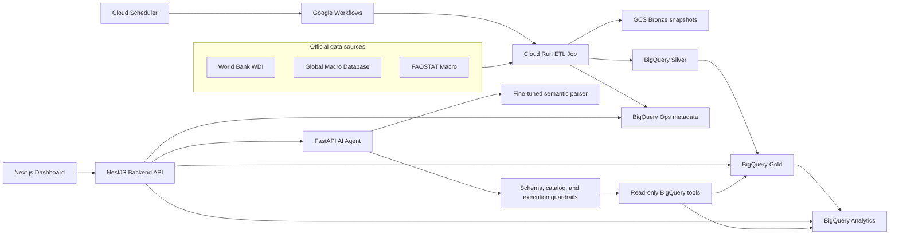

# Government AI Agent Platform

Cloud-native economic data analytics with a governed natural-language interface.

[Live demo](https://gov-ai-frontend-lnv3c6gztq-as.a.run.app) | [Repository](https://github.com/DataMeowTt/Government-Ai-Agent-Platform)

## Overview

Government AI Agent Platform integrates public economic data, prepares it for analytics, and exposes it through both a dashboard and an AI assistant. The system follows a **BigQuery-direct** architecture: BigQuery is the analytical source of truth for the Backend API and the AI Agent, while Google Cloud Storage preserves raw snapshots and operational evidence.

The platform currently integrates:

- World Bank World Development Indicators (WDI)
- Global Macro Database (GMD)
- FAOSTAT Macro

The demo dataset contains more than **1.16 million raw rows** before normalization. It supports country profiles, indicator comparison, structural clustering, anomaly exploration, data freshness tracking, and natural-language economic questions.

## Key Features

- Multi-source ingestion with source fingerprints, snapshots, manifests, and lineage artifacts
- Layered warehouse design: GCS Bronze and BigQuery Silver, Gold, Analytics, and Ops
- Contract-driven indicators, tables, and data-quality rules
- Dashboard pages for countries, indicators, comparison, clusters, anomalies, and AI chat
- Guarded BigQuery access with table and column allowlists, parameterized inputs, result limits, and query cost limits
- Natural-language parsing into a typed `ParsedQuery` JSON object instead of free-form SQL generation
- Schema, catalog, and safe-to-execute validation before any AI data query
- Read-only AI tools for lookup, comparison, ranking, trends, anomalies, and coverage
- Monthly Google Cloud automation with Scheduler, Workflows, and a Cloud Run Job
- Operational freshness metadata exposed to the frontend

## Architecture



### Main request flows

**Dashboard flow**

```text
User -> Next.js frontend -> NestJS endpoint -> guarded BigQuery query -> table/chart response
```

**AI flow**

```text
Question -> Backend proxy -> AI Agent -> ParsedQuery JSON
         -> schema/catalog/safety checks -> read-only BigQuery tool
         -> grounded answer + table data + chart configuration
```

The AI Agent does not receive permission to write warehouse data or trigger the ETL pipeline.

## Data Platform

### Source scale used by the demo

| Source | Rows | Columns | Source shape |
| --- | ---: | ---: | --- |
| WDI | 403,256 | 70 | World Bank bulk CSV, wide by year |
| FAOSTAT Macro | 708,632 | 13 | Normalized CSV with codebook |
| GMD | 56,864 | 84 | Wide country-year CSV |
| **Total** | **1,168,752** | - | Raw rows before normalization |

### Storage layers

| Layer | Storage | Purpose |
| --- | --- | --- |
| Bronze | Google Cloud Storage | Raw snapshots, manifests, fingerprints, lineage, and recovery evidence |
| Silver | BigQuery `gov_ai_silver` | Normalized long-format records by country, year, indicator, and source |
| Gold | BigQuery `gov_ai_gold` | Curated subject tables for growth, fiscal and monetary data, crisis risk, social welfare, and structural composition |
| Analytics | BigQuery `gov_ai_analytics` | Derived trend, anomaly, residual, and clustering outputs |
| Ops | BigQuery `gov_ai_ops` | Pipeline run metadata, publish status, source state, and freshness |

The shared contracts in [`contracts/`](contracts/) define public indicators, table structure, capabilities, units, mappings, and quality rules. Generated artifacts keep the Python pipeline, TypeScript backend, and AI catalog aligned.

## AI Agent

The semantic parser converts a user question into fields such as:

```json
{
  "intent": "COMPARE_COUNTRIES",
  "indicators": ["govdebt_GDP"],
  "countries": ["VNM", "THA"],
  "start_year": 2010,
  "end_year": 2023,
  "chart_preference": "line",
  "needs_clarification": false
}
```

The parser was fine-tuned from `Qwen/Qwen3-4B-Instruct-2507` with QLoRA/LoRA on a 30,000-example domain dataset covering 27 intents, 151 question families, 88 countries, and 56 indicators.

### Parser evaluation

Results below are from the report's stratified 1,000-example test evaluation.

| Version | Valid JSON | Schema pass | Catalog pass | Exact JSON | Intent accuracy | Indicator F1 | Country F1 | Safe execute |
| --- | ---: | ---: | ---: | ---: | ---: | ---: | ---: | ---: |
| v1/v2 | 100.0% | 95.3% | 77.3% | 3.0% | 23.71% | 85.38% | 88.95% | 36.2% |
| v3 | 100.0% | 99.3% | 83.6% | 63.2% | 95.47% | 97.08% | 94.49% | 70.7% |
| v3.1 | 100.0% | 99.3% | 85.8% | 63.2% | 95.47% | 97.08% | 94.49% | 71.7% |

`Safe execute` is intentionally lower than JSON validity because the evaluation set includes incomplete, unsupported, and off-topic questions that should be clarified or rejected instead of executed.

## Application Pages

| Route | Purpose |
| --- | --- |
| `/` | Platform overview and data freshness |
| `/countries` | Search and browse countries |
| `/countries/[code]` | Country profile, indicators, anomalies, and cluster benchmarks |
| `/indicators` | Public indicator catalog and metadata |
| `/compare` | Compare indicators across countries and years |
| `/clusters` | Explore structural country groups |
| `/anomalies` | Filter and inspect statistically unusual observations |
| `/chat` | Ask economic data questions in natural language |

## Technology Stack

| Area | Technologies |
| --- | --- |
| Frontend | Next.js 16, React 19, TypeScript, Tailwind CSS, TanStack Query/Table, Recharts, Zustand, Zod |
| Backend API | NestJS 11, TypeScript, Google Cloud BigQuery client, Axios, TypeORM/PostgreSQL fallback |
| AI Agent | FastAPI, Pydantic, Google Gen AI SDK, BigQuery client, deterministic and Gemini-assisted composers |
| Semantic parser | Qwen3 4B Instruct, QLoRA/LoRA adapter, JSON schema and catalog guardrails |
| Data pipeline | Python 3.11, PySpark 4.1.1, Pandas, PyArrow, Google Cloud Storage and BigQuery clients |
| Analytics | Pandas, NumPy, scikit-learn |
| Cloud | Cloud Run services, Cloud Run Jobs, Google Workflows, Cloud Scheduler, GCS, BigQuery, Artifact Registry |
| Quality | Jest, pytest, Ruff, mypy, data contracts, warehouse validation, smoke tests |

## Repository Structure

```text
.
|-- contracts/                    # Indicator, table, and data-quality contracts
|-- fe/                           # Next.js dashboard and AI chat frontend
|-- infra/gcp/cloud-run/          # Cloud Run deployment configuration examples
|-- scripts/                      # Contract, deployment, ETL, and validation utilities
|-- server/                       # NestJS Backend API
|-- services/
|   |-- ai-agent-service/         # FastAPI AI Agent and BigQuery tools
|   |-- analytics-worker/         # Trend, anomaly, clustering, and batch analytics
|   |-- data-pipeline/            # Source ingestion and Bronze/Silver/Gold publishing
|   `-- query-agent/              # Parser datasets, training, evaluation, inference, and model artifact
`-- sql/bigquery/                 # Generated BigQuery DDL
```

## Getting Started

### Prerequisites

- Node.js 20+
- Python 3.11+; Python 3.12 is used by the AI Agent container
- Java 17 for local PySpark pipeline execution
- Google Cloud CLI and credentials with access to the configured BigQuery datasets
- Optional: Docker for container builds and Cloud Run parity

Authenticate the local BigQuery clients with Application Default Credentials:

```powershell
gcloud auth application-default login
gcloud config set project western-pivot-452008-a6
```

Access to the deployed project's datasets is required. For another Google Cloud project, create equivalent datasets and override the environment variables below.

### 1. Clone the repository

```powershell
git clone https://github.com/DataMeowTt/Government-Ai-Agent-Platform.git
cd Government-Ai-Agent-Platform
```

### 2. Start the AI Agent

```powershell
cd services/ai-agent-service
python -m venv .venv
.\.venv\Scripts\Activate.ps1
pip install -r requirements.txt
```

Create `services/ai-agent-service/.env`:

```dotenv
PORT=8002
INTERNAL_API_KEY=dev-internal-key
AI_AGENT_DATA_SOURCE=bigquery
BIGQUERY_PROJECT_ID=western-pivot-452008-a6
BIGQUERY_LOCATION=asia-southeast1
BIGQUERY_GOLD_DATASET=gov_ai_gold
BIGQUERY_ANALYTICS_DATASET=gov_ai_analytics
BIGQUERY_MAX_BYTES_BILLED=100000000

# Required for the fine-tuned external parser path used by the full demo flow.
PARSER_SERVICE_BASE_URL=https://your-parser-service.example.com

# Optional Gemini routing/composition.
ENABLE_GEMINI=false
GEMINI_API_KEY=
```

Run the service:

```powershell
uvicorn app.main:app --reload --port 8002
```

Health endpoint: `http://localhost:8002/health`

### 3. Start the Backend API

Open another terminal:

```powershell
cd server
npm ci
```

Create `server/.env`:

```dotenv
PORT=3001
NODE_ENV=development
BACKEND_DATA_SOURCE=bigquery
BIGQUERY_PROJECT_ID=western-pivot-452008-a6
BIGQUERY_LOCATION=asia-southeast1
BIGQUERY_GOLD_DATASET=gov_ai_gold
BIGQUERY_ANALYTICS_DATASET=gov_ai_analytics
BIGQUERY_OPS_DATASET=gov_ai_ops
BIGQUERY_MAX_BYTES_BILLED=100000000
BIGQUERY_CACHE_TTL_SECONDS=300
AI_AGENT_BASE_URL=http://localhost:8002
AI_AGENT_TIMEOUT_MS=90000
AI_AGENT_INTERNAL_API_KEY=dev-internal-key
CORS_ORIGINS=http://localhost:3000
```

Run the API:

```powershell
npm run start:dev
```

Backend base URL: `http://localhost:3001`

### 4. Start the Frontend

Open a third terminal:

```powershell
cd fe
npm ci
Copy-Item .env.example .env.local
```

Set the frontend API URL in `fe/.env.local`:

```dotenv
NEXT_PUBLIC_API_URL=http://localhost:3001
```

Start Next.js:

```powershell
npm run dev
```

Open `http://localhost:3000`.

The dashboard and BigQuery-backed API can run without Gemini. The complete natural-language parsing path additionally needs a reachable parser service; Gemini features need a valid API key when enabled.

## Backend API

| Method | Endpoint | Description |
| --- | --- | --- |
| `GET` | `/api/v1/indicators` | Public indicator catalog and capabilities |
| `GET` | `/api/v1/countries` | Countries available in the warehouse |
| `GET` | `/api/v1/countries/:code/full-analytics` | Full country analytics profile |
| `GET` | `/api/v1/countries/:code/indicators` | Country indicator series |
| `GET` | `/api/v1/countries/:code/anomalies` | Country anomaly records |
| `GET` | `/api/v1/countries/:code/cluster-benchmark` | Country cluster comparison |
| `GET` | `/api/v1/compare` | Country/indicator comparison by year range |
| `GET` | `/api/v1/analytics/clusters` | Structural clustering results |
| `GET` | `/api/v1/analytics/anomalies` | Paginated anomaly results |
| `POST` | `/api/v1/ai/chat` | Backend proxy to the AI Agent |
| `GET` | `/api/v1/ai/health` | AI Agent connectivity check |
| `GET` | `/api/v1/system/data-freshness` | Latest successful pipeline metadata |

## Data Pipeline

Install the pipeline and development dependencies:

```powershell
cd services/data-pipeline
python -m venv .venv
.\.venv\Scripts\Activate.ps1
pip install -e ".[dev]"
```

Inspect the guarded scheduled pipeline options:

```powershell
python -m jobs.scheduled_pipeline --help
python -m jobs.plan_snapshot --help
```

The production demo uses:

- Cloud Run Job: `gov-ai-snapshot-plan`
- Workflow: `economic-data-pipeline`
- Scheduler: `economic-data-pipeline-monthly`
- Schedule: day 5 of every month at `02:00 UTC`
- ETL runtime: 2 CPU, 8 GiB memory, 1-hour timeout

The base ETL job is kept non-writing. Write approval is passed only through a controlled workflow execution, followed by validation, scoped publish, recovery support, and `SUCCESS` metadata.

## Testing and Validation

### Frontend

```powershell
cd fe
npm run lint
npm run build
```

### Backend

```powershell
cd server
npm test -- --runInBand
npm run test:e2e
npm run build
```

### AI Agent

```powershell
cd services/ai-agent-service
pip install pytest
pytest tests -q
```

### Data pipeline

```powershell
cd services/data-pipeline
pip install -e ".[dev]"
pytest
ruff check .
```

### Shared contracts

```powershell
python scripts/validate_indicator_contract.py
python scripts/parser_catalog_audit.py
```

## Cloud Deployment

Deployment examples live in [`infra/gcp/cloud-run/`](infra/gcp/cloud-run/). Create local copies for secrets and environment-specific values:

```powershell
Copy-Item infra/gcp/cloud-run/deploy.env.example infra/gcp/cloud-run/deploy.env.local
Copy-Item infra/gcp/cloud-run/backend.env.example infra/gcp/cloud-run/backend.env.local
Copy-Item infra/gcp/cloud-run/ai-agent.env.example infra/gcp/cloud-run/ai-agent.env.local
```

Review the service deployment plan before applying it:

```powershell
.\scripts\deploy_cloud_run_services.ps1 -PlanOnly
```

The deployment scripts build and publish the Backend and AI Agent images, deploy Cloud Run services, configure runtime identities and environment values, and run smoke checks. The ETL job, workflow, and scheduler have separate planning utilities under [`scripts/`](scripts/).

## Current Limitations

- The fine-tuned parser currently uses a separate demo deployment path and is not yet a production-grade managed service.
- Parser exact-JSON accuracy is 63.2%, although intent, indicator, and country metrics are substantially higher and downstream guardrails reject unsafe plans.
- Current analytics are primarily descriptive; forecasting, causal inference, policy simulation, and uncertainty modeling are outside the present scope.
- Dashboard evaluation is currently based on functional and smoke testing rather than a formal end-user usability study.
- A production rollout still needs stronger authentication, authorization, rate limiting, audit logging, alerting, rollback automation, and cost monitoring.

## Project Status

The end-to-end demo has verified:

- A controlled ETL run with `SUCCESS` metadata
- Monthly workflow and scheduler configuration
- BigQuery-backed data freshness through the Backend API
- AI health check returning HTTP 200
- AI chat smoke test returning a successful response
- Dashboard flows for country lookup, comparison, anomalies, clusters, indicators, and AI chat

This repository is an academic/demo implementation. Treat cloud identifiers, external parser endpoints, and model artifacts as environment-specific when adapting it for another deployment.
